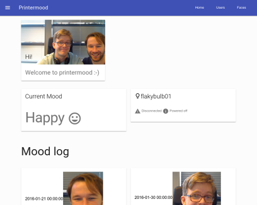

Match the light in your printer room with how the user feels

 
## Install

### Docker
The support for docker is still experimental, but at this point we have support for python-opencv and scikit-learn, which is a major step forward.

    docker build -t robertko/printermood .
    xhost +SI:localuser:root  # add root user to xserver access control list (.Xauthority)
    docker run -ti --rm --privileged -e DISPLAY -v /tmp/.X11-unix:/tmp/.X11-unix robertko/printermood python printermood/cam.py

### Manually
    apt install mongo-server python3-venv python3-dev
    apt-get build-dep python-pil
    pyenv venv
    . venv/bin/activate
    pip install -r requirements.txt
    python run.py
    
    # Frontend
    cd printermood/static
    npm install
    npm install -g webpack
    npm start  # to build/package frontend stuff

    # Testing
    python -m printermood.tests

### OpenCV install python3 on ubuntu 14.04
    # Ref: http://docs.opencv.org/3.0-last-rst/doc/tutorials/introduction/linux_install/linux_install.html
    apt install python3-numpy
    apt-get build-dep python-opencv
    wget https://github.com/Itseez/opencv/archive/3.1.0.zip
    unzip opencv-3.1.0.zip
    cd opencv-3.1.0
    mkdir build && cd build
    cmake -D CMAKE_BUILD_TYPE=Release -D CMAKE_INSTALL_PREFIX=/usr/local -D PYTHON3_EXECUTABLE=/usr/bin/python3.4 -D PYTHON_INCLUDE_DIR=/usr/include/python3.4 -D PYTHON_INCLUDE_DIR2=/usr/include/x86_64-linux-gnu/python3.4m -D PYTHON_LIBRARY=/usr/lib/x86_64-linux-gnu/libpython3.4m.so -D PYTHON3_NUMPY_INCLUDE_DIRS=/usr/lib/python3/dist-packages/numpy/core/include/ -D PYTHON3_PACKAGES_PATH=/usr/lib/python3/dist-packages ..
    sudo make install -j `cat /proc/cpuinfo |grep processor|wc -l`

## TODO

- [x] Capture image if motion and face is detected, per 3s
- [ ] Send image to Indico and save result
- [ ] On 5 faces with same emotion (confidence above ~0.4) set lightbulb state to specified color
- [ ] include ideas from https://indico.io/blog/exploring-computer-vision-improving-security-cameras-machine-learning/ , https://github.com/nlintz/Indico-Security-Camera/blob/master/controllers/lastUpdate.js

# Models

- User: name
- LIFXLight: name, power_state, id, ...
- Faces: image data, timestamp, metadata, url
- Mood: user_id, name, face_id

## Colors
Confidence maps to light intensity

- sad = blue
- angry = red
- happy = green
- neutral = white
- surprise = pink
